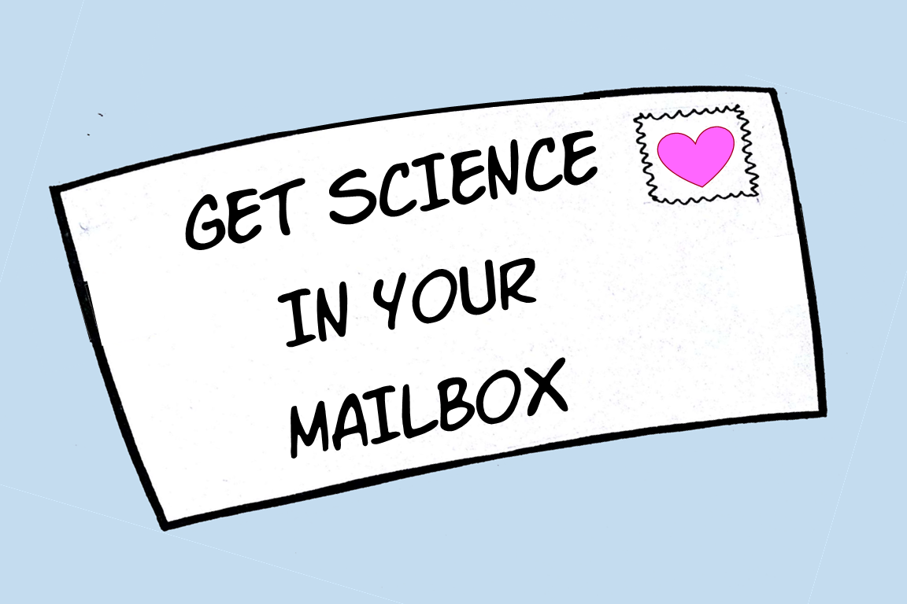

			<section id="three" class="wrapper style1">
				

					

						

							<section>
								<h2>About</h2>
								
								
I'm Jenny Ballif, also known as "Science Mom." It all started when my son was in first grade and I volunteered to do science demonstrations for his class. I don't remember if it was the kids or the teacher who came up with "Science Mom," but the name stuck and the gig grew; within a year I was visiting ten classrooms a week.

								
The world needs more curiosity, wonder, and investigative thinking—and that’s just what my videos and Science Mom Guides aim to encourage. They're all free! Download the guides and make as many copies as you like. Share them with your kids, parents, classroom, teachers, and friends.

							</section>
						

						

							<section>
								<h2>Links</h2>
								<ul class="alt">
									<li><a href="https://www.youtube.com/channel/UC-QcZISbFb9EiIEQ41cVhxw">Science Mom Youtube Channel</a></li>
									<li><a href="https://www.patreon.com/JennyBallif">Patreon</a></li>
									<li><a href="#">Teachers Pay Teachers</a>  (coming soon)</li>
								</ul>
							</section>
							

							<section>
								<!-- <h3><a href="http://patreon.com/jennyballif">Become a patron </a></h3> -->
								
								<ul class="actions">
									<li><a href="http://patreon.com/jennyballif" class="button alt">Learn More</a></li>
								</ul>
							</section>
						

					

				

			</section>	

		

			

				<a href="sciencemom.html" style="display:block; text-decoration:none;">
				<section class="special box">
					<i class="icon fa-rocket major"></i>
					<h3>Science Mom Guides</h3>
					
Printable coloring books with directions for hands-on science activities.

				</section>
				</a>
			

			

				<a href="activities.html" style="display:block; text-decoration:none;">
				<section class="special box">
					<i class="icon fa-pencil-square-o major"></i>
					<h3>Science Activities</h3>
					
A summary table of all the science activities and their required supplies.

				</section>
				</a>
			

			

				<a href="videos.html" style="display:block; text-decoration:none;">
				<section class="special box">
					<i class="icon fa-youtube-play major"></i>
					<h3>Science Mom Videos</h3>
					
Watch science mom teach lessons corresponding with each guide

				</section>
				</a>
			

		

	

  

