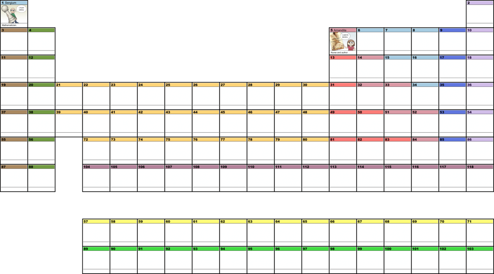

	

		

			

				<a href="sciencemom.html" style="display:block; text-decoration:none;">
				<section class="special box">
					
					<!--<i class="icon fa-rocket major"></i>-->
					<h3>Science Mom Guides</h3>
					
Science lessons with hands-on investigations

				</section>
				</a>
			

			

				<a href="sciencemom.html" style="display:block; text-decoration:none;">
				<section class="special box">
					
					<!--<i class="icon fa-rocket major"></i>-->
					<h3>Science Activities</h3>
					
A summary table of all activities and supplies.

				</section>
				</a>
			

			

				<a href="sciencemom.html" style="display:block; text-decoration:none;">
				<section class="special box">
					
					<!--<i class="icon fa-rocket major"></i>-->
					<h3>Education Videos</h3>
					
Watch science lessons, tips for teachers, and more.

				</section>
				</a>
			

			

				<a href="sciencemom.html" style="display:block; text-decoration:none;">
				<section class="special box">
					
					<!--<i class="icon fa-rocket major"></i>-->
					<h3>Coloring Books</h3>
					
Printable, miniature, foldable books.

				</section>
				</a>
			

			

				<a href="sciencemom.html" style="display:block; text-decoration:none;">
				<section class="special box">
					
					<!--<i class="icon fa-rocket major"></i>-->
					<h3>Math Investigations</h3>
					
Gnomes of Grid comics and activities

				</section>
				</a>
			

			

				<a href="sciencemom.html" style="display:block; text-decoration:none;">
				<section class="special box">
					
					<!--<i class="icon fa-rocket major"></i>-->
					<h3>Science Mom Journey</h3>
					
Miscellaneous initiatives and support options

				</section>
				</a>
			

		

	

	
