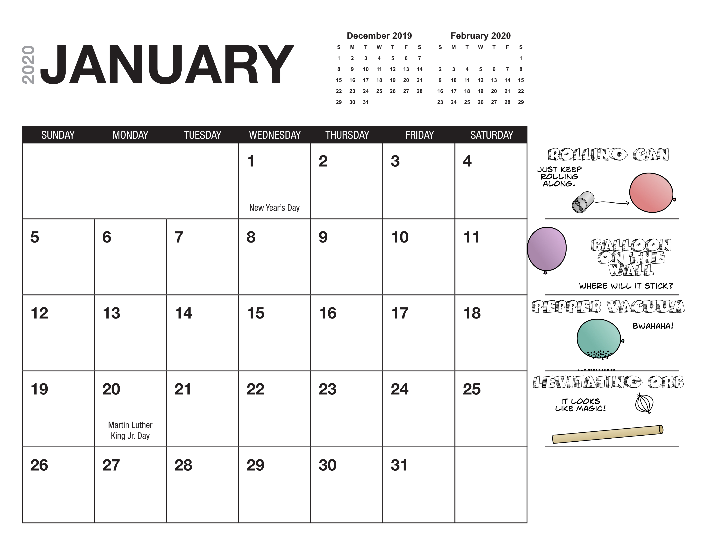

  

  

    

      
    

    

      

        <h5 class="card-title">Add the weekly science activity to your calendar</h5>
        
Get updates as videos post and instructions to carry out the science demo.

        <a href="https://calendar.google.com/calendar/r?cid=evcd1rv85b57ecnh9fpeapgse8@group.calendar.google.com" target="_blank" class="btn btn-primary">Add Calendar</a>
      

    

  

  
  
  

    

      

        

          <h3>Add the weekly reminder to your calendar</h3>
          <a href="https://calendar.google.com/calendar/r?cid=evcd1rv85b57ecnh9fpeapgse8@group.calendar.google.com" target="_blank" class="btn btn-primary">Add Calendar</a>
        

      

    

    

      

        

        
        
        
        
Get a <a href="https://marvelous-thinker-501.ck.page/a49ed8ae29" target="_blank">printable pdf calendar</a>. We'll update the calendar regularly with videos and details on how to run the weekly experiment. Enjoy!

          <a href="https://marvelous-thinker-501.ck.page/a49ed8ae29" target="_blank" class="btn btn-primary">Get pdf Calendar</a>
        

      

    

    <iframe src="https://calendar.google.com/calendar/embed?src=evcd1rv85b57ecnh9fpeapgse8%40group.calendar.google.com&ctz=America%2FLos_Angeles" style="border: 0" width="800" height="600" frameborder="0" scrolling="no"></iframe> 
  

