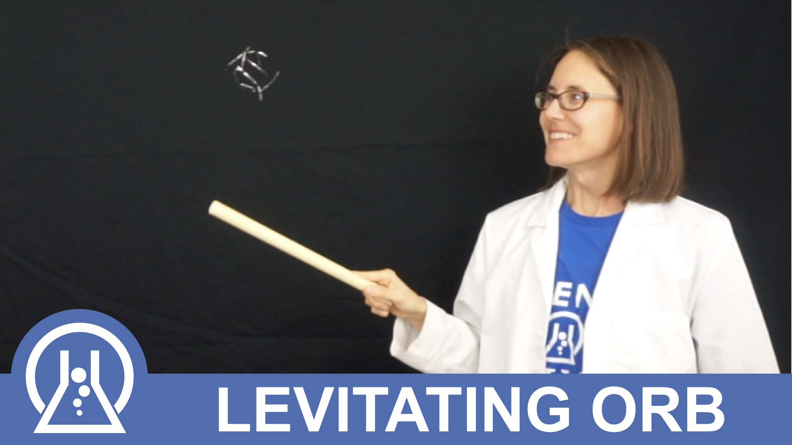

  

    

      

        
      

      

        

          <h5 class="card-title">Get a printable pdf calendar</h5>
          
Keep your kids excited for science with a scheduled weekly science demo you can do at home.

          <a href="https://marvelous-thinker-501.ck.page/a49ed8ae29" target="_blank" class="btn btn-primary">Get pdf Calendar</a>
        

      

    

  

  

    

      

        
      

      

        

          <h5 class="card-title">Add the weekly science activity to your calendar</h5>
          
Get updates as videos post and instructions to carry out the science demo.

          <a href="https://calendar.google.com/calendar/r?cid=evcd1rv85b57ecnh9fpeapgse8@group.calendar.google.com" target="_blank" class="btn btn-primary">Add Google Calendar</a>
        

      

    

  

  

    

      

        
      

      

        

          <h5 class="card-title">Get Science Fair Guides</h5>
          
Sign up to be a Patron and get a Science Fair Guide to go along with each experiment.

          <a href="http://patreon.com/sciencemom" target="_blank" class="btn btn-primary">Become a Patron</a>
        

      

    

  

  
  

    <iframe src="https://calendar.google.com/calendar/embed?src=evcd1rv85b57ecnh9fpeapgse8%40group.calendar.google.com&ctz=America%2FLos_Angeles" style="border: 0" width="800" height="600" frameborder="0" scrolling="no"></iframe>
  

